# Vault and Ansible Integration Demo

This demo showcases secure credential management using HashiCorp Vault with Ansible automation on RHEL, featuring automatic secret rotation and zero-downtime application updates.

## 🎯 Demo Overview

**What this demo shows - Product Integration:**

**HashiCorp Products:**
- **HCP Vault** - Centralized secrets management and storage
- **Terraform** - Infrastructure provisioning (AWS VPC, EC2, security groups)
- **Vault Enterprise Features** - Namespaces, AppRole authentication, KV v2 secrets engine

**Red Hat/IBM Products:**
- **Red Hat Enterprise Linux (RHEL 9)** - Enterprise operating system platform
- **Ansible** - Configuration management and application deployment automation
- **Python/Flask** - Sample application demonstrating secret consumption

**Integration Points Demonstrated:**
- Ansible authenticating to HCP Vault using AppRole (no hardcoded secrets)
- Terraform provisioning RHEL infrastructure with automated Ansible setup
- Vault securely storing and rotating database credentials and API keys
- Ansible retrieving secrets from Vault and deploying applications
- Automated secret rotation every minute with zero application downtime
- Enterprise-grade security on RHEL with HashiCorp Vault

**Target audience:** HashiCorp sales teams learning to position Red Hat/IBM Ansible and RHEL alongside HashiCorp products.

**Duration:** 10-15 minutes

## 🏗️ Architecture

```
┌─────────────────┐    ┌──────────────────┐    ┌─────────────────┐
│   HCP Vault     │    │  RHEL EC2        │    │  Demo Flask App │
│                 │◄───┤  + Ansible       │◄───┤  (Port 5000)    │
│  - AppRole Auth │    │  - Cron Job      │    │  - Shows Creds  │
│  - KV Secrets   │    │  - Rotation      │    │  - Auto-updates │
└─────────────────┘    └──────────────────┘    └─────────────────┘
```

## 📋 Prerequisites

**Required:**
- AWS Account with appropriate permissions
- HCP Account with existing Vault cluster
- SSH key pair in your AWS region
- Terraform installed locally
- Git installed locally


## 🎪 Running the Demo

### Demo Flow (10-15 minutes)

## 🔄 Demo Flow

### Architecture Overview


### Execution Sequence

```mermaid
sequenceDiagram
    participant T as Terraform
    participant V as HCP Vault
    participant A as Ansible
    participant F as Flask App
    
    Note over T,V: 🔐 Initial Secret Setup Phase
    T->>V: Use HCP admin token to configure Vault
    T->>V: Configure Vault (namespaces, AppRole, generate credentials)
    T->>V: Seed initial secrets (DB creds, API key)
    
    Note over T,A: 🚀 Infrastructure Deployment Phase  
    T->>A: Deploy RHEL instance to host the app
    T-->>A: Securely pass admin token + AppRole credentials + Vault config via user-data
    
    Note over A,V: 🔑 Ansible Authentication Phase
    A->>V: Authenticate with AppRole (role_id + secret_id) → get Ansible token
    
    Note over A,F: 📦 Application Deployment Phase
    A->>V: Retrieve DB credentials using Ansible token
    A->>V: Retrieve API key using Ansible token
    V-->>A: Return encrypted secrets
    A->>F: Deploy Flask app with secrets as env vars
    A->>A: Configure systemd service with secret env vars
    A->>F: Start Flask application
    
    Note over F: 🌐 App shows truncated creds (security)
    
    Note over A,F: 🔄 Continuous Secret Rotation (Every 1 minute)
    loop Every 1 minute via cron
        A->>V: Retrieve updated secrets
        V-->>A: Return new encrypted secrets
        A->>F: Update systemd service file with new env vars
        A->>F: Restart Flask app (zero downtime)
        Note over F: App now shows new truncated creds
    end
```


#### 1. Show the Running Application (2 minutes)
- Navigate to the application URL from Terraform output
- Point out the truncated credentials displayed
- Explain these come from Vault, deployed via Ansible

#### 2. Demonstrate Live Secret Rotation (3-5 minutes)
- Refresh the browser every 60 seconds
- Watch credentials change automatically (first 3 characters will change)
- Highlight zero-downtime rotation

#### 3. Show the Ansible Configuration (3-4 minutes)
Navigate to the GitHub repository to show the Ansible automation:

**Browse to:** https://github.com/stoffee/secrets-demos/tree/main/ansible-vault-demo

**Key files to highlight:**

**Authentication & Secret Retrieval:**
- [`playbooks/vault-auth.yml`](https://github.com/stoffee/secrets-demos/blob/main/ansible-vault-demo/playbooks/vault-auth.yml) - AppRole authentication to Vault
- [`playbooks/get-secrets.yml`](https://github.com/stoffee/secrets-demos/blob/main/ansible-vault-demo/playbooks/get-secrets.yml) - Secure secret retrieval from Vault

**Application Deployment:**
- [`playbooks/deploy-app.yml`](https://github.com/stoffee/secrets-demos/blob/main/ansible-vault-demo/playbooks/deploy-app.yml) - Complete application deployment with secrets
- [`playbooks/templates/app.py.j2`](https://github.com/stoffee/secrets-demos/blob/main/ansible-vault-demo/playbooks/templates/app.py.j2) - Flask application template

**Secret Rotation:**
- [`playbooks/rotate-secrets.yml`](https://github.com/stoffee/secrets-demos/blob/main/ansible-vault-demo/playbooks/rotate-secrets.yml) - Automated secret rotation with zero downtime

**Infrastructure Setup:**
- [`terraform/`](https://github.com/stoffee/secrets-demos/tree/main/ansible-vault-demo/terraform) - Complete Terraform configuration
- [`terraform/hcp-vault.tf`](https://github.com/stoffee/secrets-demos/blob/main/ansible-vault-demo/terraform/hcp-vault.tf) - Vault namespace, auth methods, and policies

**Key talking points:**
- Show how Ansible abstracts complex Vault operations into simple, readable playbooks
- Highlight the AppRole authentication (no hardcoded secrets)
- Point out the systemd service template that injects secrets as environment variables
- Explain how the cron job (in deploy-app.yml) handles automatic rotation

#### 4. Manual Rotation
```bash
# Manually trigger rotation to show immediate effect
cd /opt/ansible-demo
ansible-playbook playbooks/rotate-secrets.yml